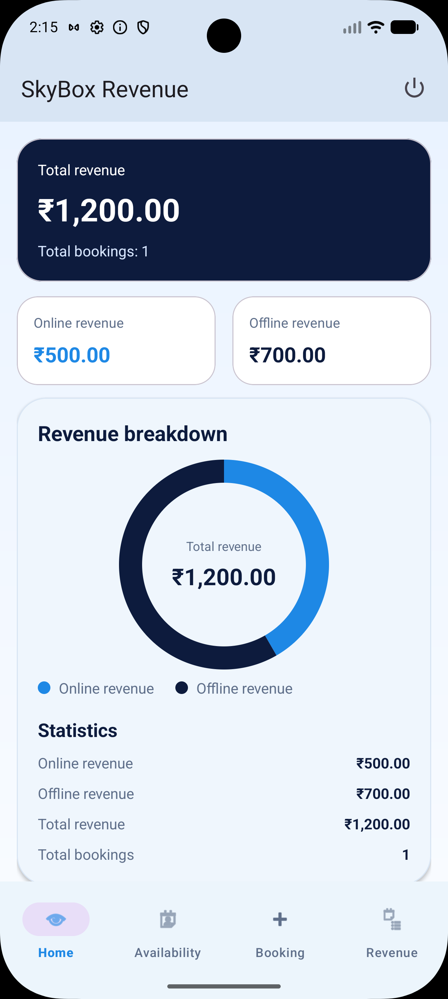
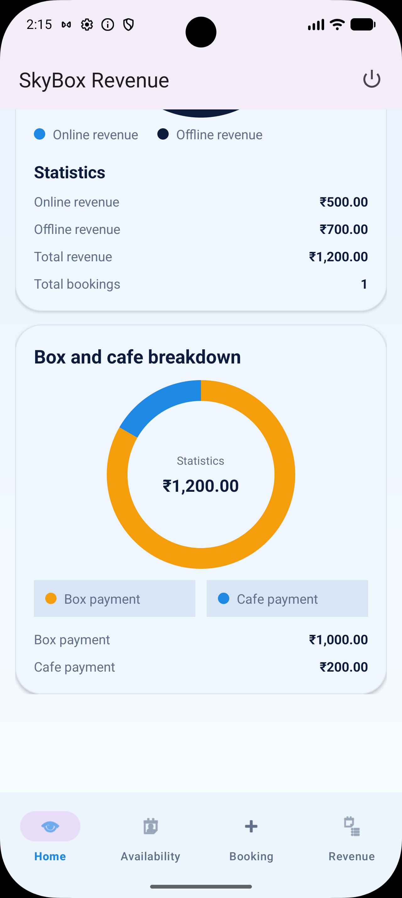
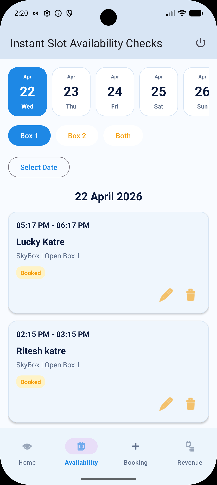
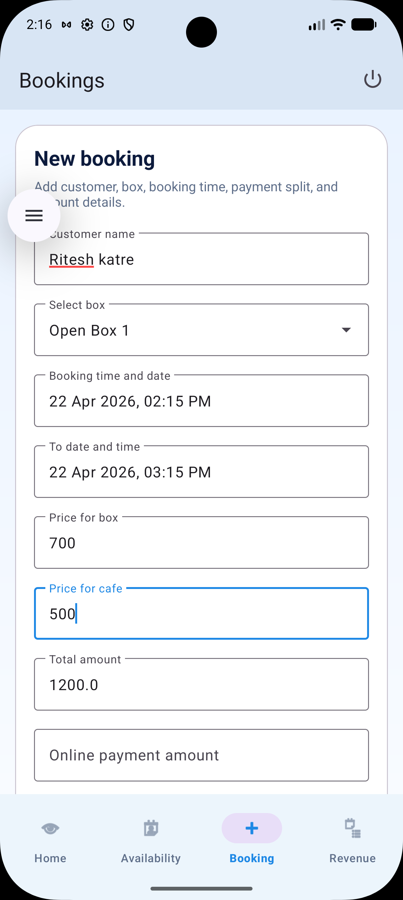
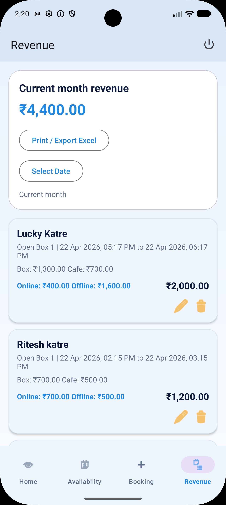

# 📱 Money Management & Booking App

## 📌 Overview
This application is a **Money Management and Booking System** designed to track revenue and manage bookings efficiently. It provides a complete solution for monitoring **online and offline payments**, analyzing revenue sources, and handling booking slots with full control over data.

The app is built using **Android** and integrates **Firebase APIs** for real-time data storage and management.

---

## 🚀 Features

### 💰 Revenue Management
- Track **Total Revenue**
- Separate tracking for:
  - Online Payments  
  - Offline Payments  
- Revenue breakdown by:
  - Cafe  
  - Box (or other business units)
- Monthly revenue summary

---

### 📊 Advanced Filters
- View data using:
  - 📅 Day-wise filter  
  - 📆 Date range filter  
- Analyze revenue trends easily

---

### 🧾 PDF Reports
- Generate **Revenue Reports in PDF**
- Download and share reports
- Useful for accounting and business insights

---

### 📅 Booking Management
- Add new booking slots  
- View booking list  
- Edit booking details  
- Delete bookings  

---

### 🔥 Real-Time Database
- Integrated with **Firebase**
- Real-time data updates
- Scalable and secure backend

---

## 🛠️ Tech Stack
- **Language:** Kotlin  
- **Architecture:** MVVM  
- **Backend:** Firebase (Firestore / Realtime Database)  
- **UI:** XML (Android)  
- **PDF Generation:** 

---

## 📸 Screenshots

### Home Screen

### Shown Booked Slot Screen

### Add Booking Form Screen

### Revenue Screen

---
